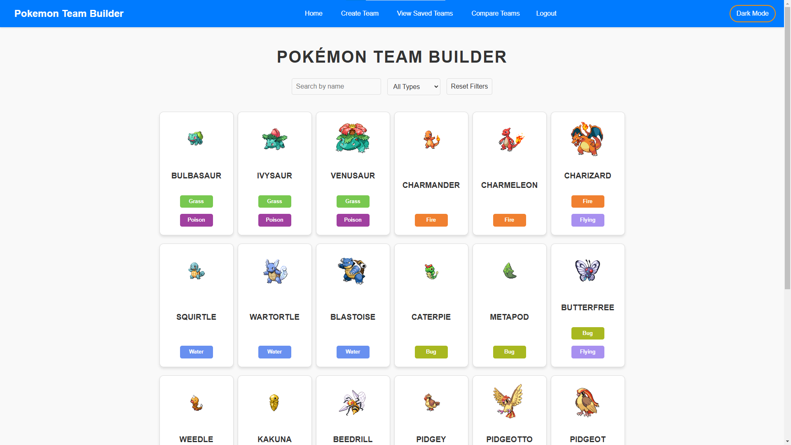
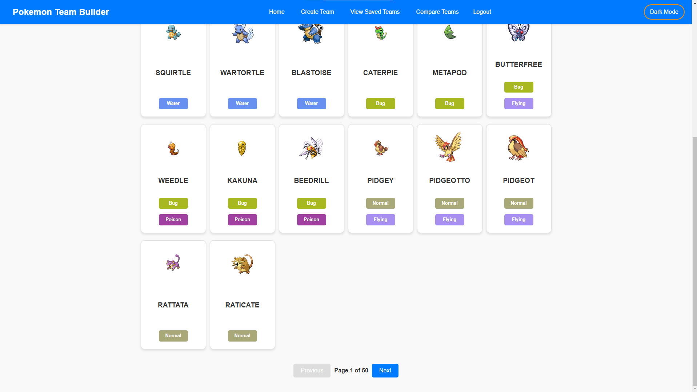
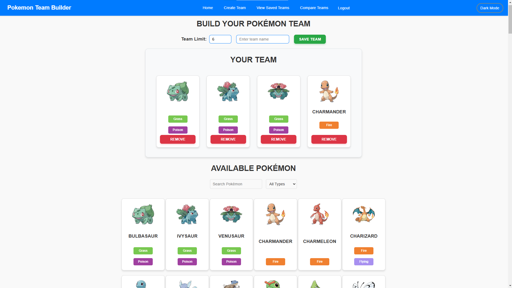

# Pokémon Team Builder

Welcome to **Pokémon Team Builder**, a web application where users can create and manage their Pokémon teams, compare stats, and more! This app allows users to interact with a Pokémon database, build custom teams, and view saved teams in a user-friendly interface with support for both **light** and **dark** modes.

---

## Features

- **Create Pokémon Teams:** Build a team by selecting Pokémon from a comprehensive list, complete with images and stats.
- **View Saved Teams:** View and manage saved Pokémon teams.
- **Compare Teams:** Compare two Pokémon teams to analyze their stats side by side.
- **User Authentication:** Register and log in to save your teams.
- **Dark Mode:** Toggle between light and dark themes for a better user experience.
- **Responsive Design:** Works seamlessly across different screen sizes, from desktop to mobile.

---

## Technologies Used

- **Frontend:**
  - React.js
  - React Router
  - CSS (for styling)
  - Responsive Grid Layouts
  - Theme Toggle for Light/Dark Mode

- **Backend:**
  - Node.js with Express (for user authentication and team data handling)
  - RESTful API (for fetching Pokémon data)
  - JWT Authentication

- **External APIs:**
  - [Pokémon API](https://pokeapi.co) - For fetching Pokémon data (stats, images, types).

---

## Installation & Setup

To run this project locally, follow these steps:

### Prerequisites
- [Node.js](https://nodejs.org/) (LTS version recommended)
- [npm](https://www.npmjs.com/get-npm) (comes with Node.js)

### Clone the Repository

```bash
git clone https://github.com/YourUsername/pokemon-team-builder.git
cd pokemon-team-builder
```

### Install Dependencies

```bash
npm install
```

### Start the MongoDB Server

Navigate to backend and run the command:

```bash
node server.js
```

### Start the App Server

```bash
npm start
```

This will run the app on `http://localhost:8080` in your browser.

---

## Folder Structure

```
POMEKON-TEAM-BUILDER/              # Root directory of the project
├── backend/                      # Backend directory, contains server-side files
│   ├── middleware/               # Middleware for handling requests and authorization
│   │   └── authMiddleware.js     # Middleware for handling authentication checks
│   ├── models/                   # Database models
│   │   └── User.js               # User model for managing user-related data
│   ├── node_modules/             # Directory for all the backend dependencies
│   ├── routes/                   # Backend API routes
│   │   ├── auth.js               # Authentication routes for login/register
│   │   └── team.js               # Routes for managing Pokémon teams
│   ├── .env                      # Environment variables (like DB credentials, API keys)
│   ├── package-lock.json         # Lock file to ensure consistent dependency installation
│   ├── package.json              # Defines project dependencies and scripts
│   └── server.js                 # Entry point for the backend server
├── images/                       # Directory for images used in the frontend
│   ├── CreateTeamPage.png        # Image for Create Team Page
│   ├── HomePage1.png             # Home page related image
│   ├── HomePage2.png             # Another image related to home page
├── public/                       # Public files served directly by the web server
│   ├── favicon.ico               # Favicon for the app
│   ├── index.html                # Main HTML file for the frontend
│   ├── logo192.png               # Image used for branding (192px size)
│   ├── logo512.png               # Image used for branding (512px size)
│   ├── manifest.json             # Web app manifest for PWA (Progressive Web App)
│   └── robots.txt                # File instructing web crawlers how to index the app
├── src/                          # Source code for the frontend
│   ├── components/               # Reusable components used across pages
│   │   ├── Navbar.css            # Styles for the Navbar component
│   │   ├── Navbar.js             # Navbar component (links, theme toggle, etc.)
│   │   ├── ProtectedRoute.js     # Component for handling protected routes (e.g., requiring login)
│   ├── css/                       # Directory for styling files
│   │   ├── AuthPage.css          # Styles for the AuthPage (login/register)
│   │   ├── BattlePage.css        # Styles for the Battle Page
│   │   ├── CompareTeamsPage.css  # Styles for the Compare Teams Page
│   │   ├── CreateTeamPage.css    # Styles for the Create Team Page
│   │   ├── HomePage.css          # Styles for the Home Page
│   │   ├── PokemonDetails.css    # Styles for the Pokémon details page
│   │   ├── TeamsPage.css         # Styles for the Teams Page
│   ├── pages/                     # Pages representing different views/screens
│   │   ├── BattlePage.js         # Page where battle happens between Pokémon teams
│   │   ├── CompareTeamsPage.js   # Page to compare two Pokémon teams
│   │   ├── CreateTeamPage.js     # Page to create a new Pokémon team
│   │   ├── HomePage.js           # Main homepage of the app
│   │   ├── LoginPage.js          # Login page for authentication
│   │   ├── PokemonDetails.js     # Detailed view of a Pokémon
│   │   ├── RegisterPage.js       # Registration page for new users
│   │   ├── TeamsPage.js          # Page displaying the saved teams
│   ├── App.css                   # Global CSS file for the app
│   ├── App.js                    # Main component that renders the app and routes
│   ├── index.css                 # Global styles applied to the app
│   ├── index.js                  # Main entry point for React application
│   ├── logo.svg                  # Logo file used in the app
│   ├── .env                      # Environment variables specific to the frontend
├── .gitattributes                # Git attributes for managing line endings, etc.
├── .gitignore                    # Specifies which files to ignore in version control (e.g., node_modules)
├── package-lock.json             # Ensures consistent installation of dependencies
├── package.json                  # Defines frontend dependencies and scripts
├── README.md                     # Project documentation file
```

---

## Key Components

### Navbar

- **Logo:** The title of the app, linking back to the homepage.
- **Links:** Conditional rendering of links based on the user's login status.
  - If logged in: **Create Team**, **View Saved Teams**, **Compare Teams**, **Logout**.
  - If not logged in: **Register** and **Login** options are shown.
- **Theme Toggle:** Switch between light and dark modes.

### CreateTeamPage

- Allows users to build a Pokémon team by selecting Pokémon from a list.
- Pokémon data includes stats, types, and images fetched from the Pokémon API.
- Users can remove Pokémon from their team and save their teams.

### CompareTeamsPage

- Users can compare two Pokémon teams.
- Displays Pokémon stats side by side for easy comparison.
- Light and dark modes are supported, and the theme toggles automatically based on user preference.

### Pokémon Cards

- Each Pokémon is represented by a card showing its image, name, and types.
- Type badges are dynamically styled based on Pokémon types (e.g., **fire**, **water**, **grass**, etc.).

---

## Screenshots

Here are some sample screenshots of the application:

### Home Page



### Create Team Page


---

## Contributing

We welcome contributions! If you'd like to improve the project, please fork the repository and create a pull request. Here's how you can contribute:

1. Fork this repository.
2. Create a new branch (`git checkout -b feature-branch`).
3. Make your changes and commit them (`git commit -am 'Add new feature'`).
4. Push to the branch (`git push origin feature-branch`).
5. Create a new pull request.

---

## License

This project is licensed under the MIT License - see the [LICENSE](LICENSE) file for details.

---

## Acknowledgements

- **Pokémon API** - for providing the Pokémon data used in this application.
- **React** - for providing the foundation for building this web app.
- **CSS** - for styling the app, with a focus on making it responsive and visually appealing.
- **Dark Mode** - implemented to improve the user experience in different lighting conditions.

---

## Contact

For any inquiries or issues, feel free to reach out to [mouhammedmax@hotmail.com](mailto:mouhammedmax@hotmail.com) or [davidekpechue@gmail.com
](mailto:davidekpechue@gmail.com
). You can also find us on GitHub at [Riovo](https://github.com/Riovo) or [DavidEkpechue](https://github.com/DavidEkpechue).

---

Enjoy using **Pokémon Team Builder**! 🧑‍💻🐾